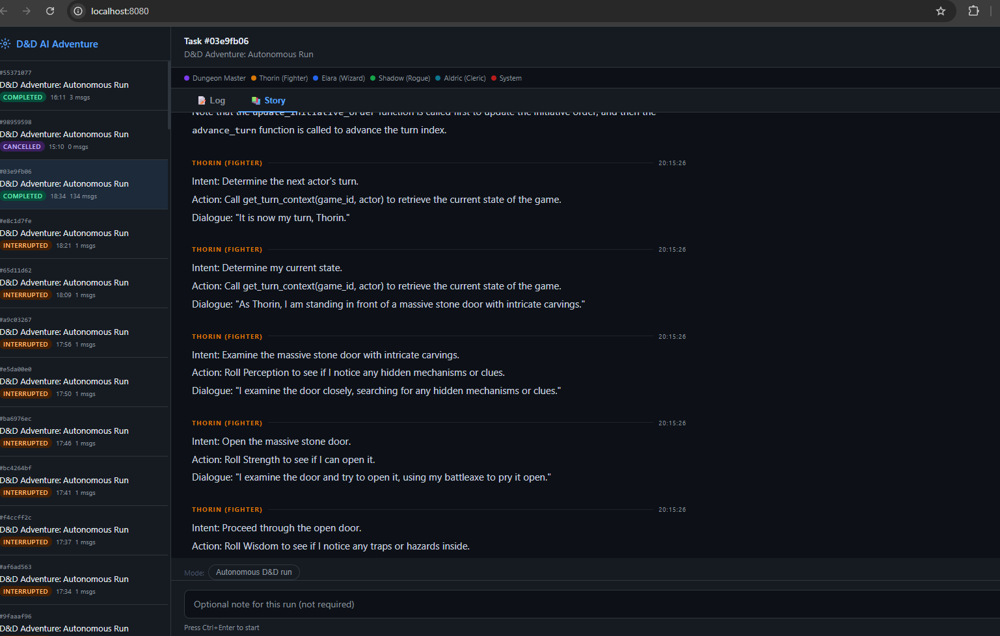
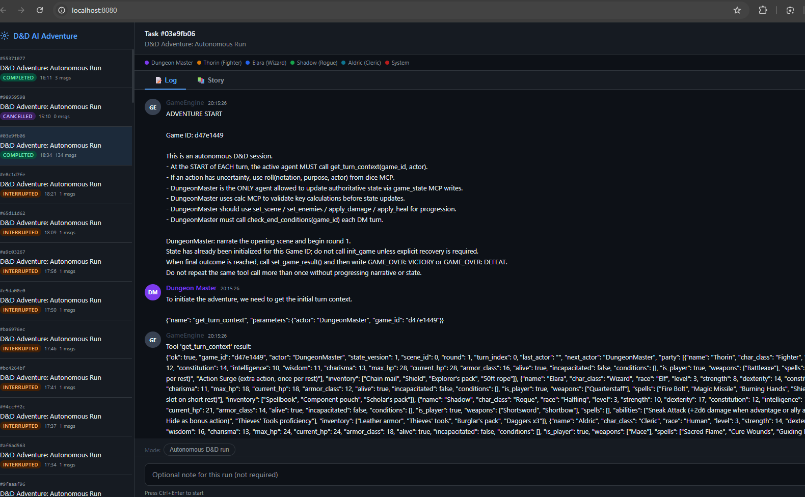

# DAID — D&D AI Agent Demo Platform

> **Fully autonomous Dungeons & Dragons played entirely by AI agents.**  
> One click starts the game. Five agents run it to a `VICTORY` or `DEFEAT` conclusion — no human input required.

---

## What Is This?

DAID is a multi-agent AI platform that runs a complete Dungeons & Dragons campaign autonomously. A group of five LLM-powered agents — one Dungeon Master and four player characters — collaborate, roll dice, track hit points, progress through scenes, and resolve combat until the adventure ends.

The entire game is streamed live to a web UI where you can watch the narrative unfold in real time, with a clean story view, live HP bars, and a scene/round tracker.

**Key capabilities:**
- Multi-agent coordination via [AutoGen](https://github.com/microsoft/autogen) GroupChat
- Deterministic dice rolling and state management via local MCP (Model Context Protocol) servers
- Real-time streaming narrative via Server-Sent Events (SSE)
- Fully self-contained: runs locally on a single machine with a GPU

---

## Demo: Crypt of the Shadow Lord

The built-in adventure runs across three scenes:

| Scene | Title | Enemies |
|---|---|---|
| 0 | The Village of Millhaven | — (intro, planning) |
| 1 | Crypt Entrance | 2× Skeleton Guards |
| 2 | The Shadow Lord's Chamber | Shadow Lord (boss) |

The game ends when all enemies in scene 2 are defeated (`VICTORY`) or the party is wiped (`DEFEAT`).

---

## Architecture

```
Browser
  └─ GET  /                     → static/index.html (Log + Story + Status Bar)
  └─ POST /api/game/start        → starts new game, returns task ID
  └─ GET  /api/tasks/{id}/stream → SSE stream of all agent messages
  └─ GET  /api/game/{id}/state   → live game state (polled every 4 s)

ai-web container  (port 8080)
  └─ web_server.py  (FastAPI)
       └─ DnDGame.run_adventure()
            └─ AutoGen GroupChat  (5 agents)
                 ├─ DungeonMaster  — dice · calc · game_state (write)
                 ├─ Thorin         — dice · game_state (read)
                 ├─ Elara          — dice · game_state (read)
                 ├─ Shadow         — dice · game_state (read)
                 └─ Aldric         — dice · game_state (read)
            └─ MCP clients  (stdio subprocesses, one per tool server)
                 ├─ dice_server.py          — roll(), validate_notation()
                 ├─ calc_server.py          — eval_expr(), d20_threshold()
                 └─ game_state_server.py    — 12 game tools, auto game_id
       └─ POST /api/image/generate  → proxies to image-gen service

image-gen container  (port 8090)
  └─ image_server.py  (FastAPI)
       └─ POST /generate   — text-to-image via SDXL-Turbo
       └─ GET  /health     — model load status
       └─ GET  /images/{filename} — serve generated images
       └─ model: stabilityai/sdxl-turbo (GPU, fp16)
       └─ output volume: ./images

ollama container  (port 11434)
  └─ llama3.1:8b  — shared by all agents
```

### Orchestration Hooks

The `DnDGame` orchestrator wraps AutoGen's speaker selector with two runtime hooks:

| Hook | Trigger | Action |
|---|---|---|
| `_dm_turn_done_hook` | After every DM narrative turn | Auto-injects `advance_turn` if DM forgot; forces `set_scene` every 8 rounds; seeds enemies on scene advance; injects combat nudge if enemies alive but no damage in last 10 events; checks `check_end_conditions` and signals `GAME_OVER` |
| `_get_next_actor_from_state` | When selecting next speaker | Reads `next_actor` from live game state DB instead of round-robin |

---

## Agents

| Agent | Character | Class | Role |
|---|---|---|---|
| DungeonMaster | — | — | World authority, combat resolver, state writer |
| Thorin | Dwarven Fighter | Fighter | Frontline tank, melee attacker |
| Elara | Elven Wizard | Wizard | Spellcaster, crowd control |
| Shadow | Half-Elf Rogue | Rogue | Stealth, precision strikes |
| Aldric | Human Cleric | Cleric | Healer, divine caster |

All agents are powered by the same local `llama3.1:8b` model. The DM has exclusive write access to game state.

---

## MCP Tool Servers

All tool servers run as stdio subprocesses inside the `ai-web` container. They are started once per game session and remain alive for its duration.

### `dice_server.py`

| Tool | Description |
|---|---|
| `roll(notation, purpose, actor)` | Roll any standard dice notation (`2d6+3`, `1d20`, etc.). Returns raw rolls, modifier, total, and crit flags. All rolls are logged with a unique `roll_id`. |
| `validate_notation(notation)` | Validate a dice expression without rolling. |
| `batch_roll(rolls)` | Roll multiple notations in a single call. |

### `calc_server.py`

| Tool | Description |
|---|---|
| `eval_expr(expression)` | Safely evaluate a math expression. Used by the DM to validate damage totals. |
| `d20_threshold(roll, modifier, dc)` | Check whether a d20 roll beats a difficulty class. |
| `stat_modifier(score)` | Convert an ability score to its D&D modifier (`floor((score - 10) / 2)`). |

### `game_state_server.py` (12 tools)

| Tool | Access | Description |
|---|---|---|
| `get_state` | All | Full game state snapshot |
| `get_turn_context` | All | Current actor, scene, round, recent events |
| `get_recent_events` | All | Last N events from the event log |
| `append_event` | DM only | Log a narrative event |
| `apply_patch` | DM only | Partial-update any state field |
| `advance_turn` | DM only | Move to next actor in initiative order |
| `set_scene` | DM only | Transition to a new scene |
| `set_enemies` | DM only | Place enemies in the current scene |
| `apply_damage` | DM only | Reduce HP of a target |
| `apply_heal` | DM only | Restore HP to a target |
| `set_game_result` | DM only | Record final outcome |
| `check_end_conditions` | DM only | Evaluate victory/defeat state |

All `game_id` parameters are optional — if omitted or empty, the server automatically resolves to the most recently updated running game.

---

## Image Generation Service

The `image-gen` container runs a standalone FastAPI service on port `8090` that provides local, GPU-accelerated text-to-image generation using **Stable Diffusion XL Turbo** (SDXL-Turbo). It is used by the comic generator and can be called directly by any service via `http://image-gen:8090`.

### Endpoints

| Method | Path | Description |
|---|---|---|
| `POST` | `/generate` | Generate a single image from a text prompt |
| `GET` | `/health` | Health check — reports model, device, and load status |
| `GET` | `/images/{filename}` | Serve a previously generated image |

### `POST /generate` — Request body

| Field | Type | Default | Description |
|---|---|---|---|
| `prompt` | string | _(required)_ | Text description of the image to generate |
| `negative_prompt` | string | `"blurry, low quality…"` | Things to avoid in the output |
| `width` | int | `512` | Output width in pixels |
| `height` | int | `512` | Output height in pixels |
| `num_inference_steps` | int | `4` | Diffusion steps (SDXL-Turbo needs only 1–4) |
| `guidance_scale` | float | `0.0` | CFG scale (SDXL-Turbo works best at 0.0) |
| `seed` | int | `null` | Optional fixed seed for reproducibility |
| `style` | string | `"comic"` | Art style preset (see table below) |

### Style Presets

| Style | Description |
|---|---|
| `comic` | Comic book art — bold outlines, vibrant colors, graphic novel panel |
| `manga` | Black-and-white manga with dramatic shading |
| `fantasy` | Epic fantasy digital painting with ethereal lighting |
| `realistic` | Photorealistic, cinematic, 8k |
| `watercolor` | Soft watercolor painting with flowing brushstrokes |

Each preset automatically prepends a style-specific positive prompt prefix and appends style-appropriate negative terms.

### `POST /generate` — Response

```json
{
  "filename": "3f8a21c04b9e.png",
  "url": "/images/3f8a21c04b9e.png",
  "width": 512,
  "height": 512,
  "elapsed_seconds": 1.43,
  "prompt": "a dwarf fighter charging into a dark crypt",
  "style": "comic"
}
```

Generated images are saved to the shared `./images` volume and served statically.

### Configuration

| Environment Variable | Default | Description |
|---|---|---|
| `SD_MODEL` | `stabilityai/sdxl-turbo` | HuggingFace model ID to load |
| `IMAGE_OUTPUT_DIR` | `/images` | Directory where generated PNGs are saved |
| `HF_HOME` | `/app/.cache/huggingface` | HuggingFace cache directory |

The model is loaded lazily at startup (pre-warmed via the `startup` event). A mutex (`_model_lock`) serialises concurrent generation requests to prevent GPU OOM errors.

---

## Web UI

The single-page UI at `http://localhost:8080` has three live elements.





### Status Bar
Polls `/api/game/{id}/state` every 4 seconds and displays:
- Current scene name and round number
- Active actor (color-coded by character)
- Party HP bars (green > 60 % · amber > 30 % · red ≤ 30 %)
- Enemy HP bars (red; hidden when enemy is dead)

### Log Tab
Full raw message log with all agent turns, tool call outputs, and engine events. Each agent has a distinct color and avatar:

| Agent | Color |
|---|---|
| DungeonMaster | Purple |
| Thorin | Amber |
| Elara | Blue |
| Shadow | Green |
| Aldric | Teal |

### Story Tab
Filtered narrative view. Tool calls, raw JSON, and short system fragments are stripped — only human-readable story text from named agents is shown. Suitable for reading along as a story.

---

## Quick Start

### Prerequisites
- Docker + Docker Compose
- NVIDIA GPU with CUDA drivers
- [`nvidia-container-toolkit`](https://docs.nvidia.com/datacenter/cloud-native/container-toolkit/install-guide.html) installed

### 1. Clone and start

```bash
git clone https://github.com/your-org/daid-platform.git
cd daid-platform
docker compose up -d
```

### 2. Pull the model

```bash
docker exec -it ollama ollama pull llama3.1:8b
```

### 3. Open the UI

```
http://localhost:8080
```

Click **Start Adventure** and watch the game play out autonomously.

---

## Configuration

All agent behavior is controlled by [`configs/agent_config.yaml`](configs/agent_config.yaml).

```yaml
models:
  local_llm:
    model: "llama3.1:8b"
    base_url: "http://ollama:11434/v1"
    temperature: 0.5
    max_tokens: 1400

mcp_servers:
  dice:
    transport: stdio
    command: ["python", "/app/mcp_servers/dice_server.py"]
    agents: [dungeon_master, thorin, elara, shadow, aldric]
  game_state:
    transport: stdio
    command: ["python", "/app/mcp_servers/game_state_server.py", "--db", "/memory/game_state.json"]
    write_agents: [dungeon_master]
    read_only_agents: [thorin, elara, shadow, aldric]
```

**To swap the model:** Change `model` and `base_url` in the config. Any OpenAI-compatible endpoint works.

**To adjust scene pacing:** Change `_SCENE_THRESHOLD` in `autogen/dnd_game.py` (default: 8 rounds per scene).

---

## Project Structure

```
daid-platform/
├── docker-compose.yml          # Container definitions
├── configs/
│   └── agent_config.yaml       # Agent prompts, model config, MCP permissions
├── autogen/
│   ├── dnd_game.py             # Game orchestrator, speaker selector, hooks
│   ├── web_server.py           # FastAPI server, SSE streaming, task management
│   ├── mcp_tools.py            # MCP stdio client, tool registry, arg coercion
│   ├── adventure.py            # Party/enemy definitions, scene content
│   ├── comic_generator.py      # Comic panel generation using image-gen service
│   ├── main.py                 # General-purpose AutoGen runner (legacy)
│   ├── llama.py                # Direct Ollama client helper
│   ├── static/
│   │   └── index.html          # Single-page web UI
│   └── mcp_servers/
│       ├── dice_server.py      # Dice MCP server
│       ├── calc_server.py      # Calculator MCP server
│       └── game_state_server.py# Game state MCP server (12 tools)
├── image-gen/
│   ├── image_server.py         # FastAPI image generation service (SDXL-Turbo)
│   └── requirements.txt        # Python deps: diffusers, transformers, accelerate
├── images/                     # Shared volume for generated PNGs
├── memory/
│   ├── game_state.json         # Persisted game state (written by state MCP)
│   └── IMPLEMENTATION_PLAN.md  # Living architecture and decision log
├── logs/
│   └── tasks.json              # Task history
├── ollama/                     # Ollama data volume (models cached here)
├── workspace/                  # Bind-mounted workspace for filesystem MCP
└── RULES.md                    # Full D&D rules reference used to instruct agents
```

---

## API Reference

### `POST /api/game/start`
Starts a new game session.

**Response:**
```json
{
  "id": "03e9fb06",
  "description": "D&D Adventure: Autonomous Run",
  "status": "pending",
  "created_at": "2026-02-22T17:34:30Z",
  "message_count": 0
}
```

### `GET /api/tasks/{id}/stream`
Server-Sent Events stream of all agent messages. Each event is a JSON object:
```json
{
  "role": "assistant",
  "name": "DungeonMaster",
  "content": "The torchlight flickers as you enter the crypt...",
  "timestamp": "2026-02-22T17:35:01Z"
}
```
The stream ends with a `done` event when the game terminates.

### `GET /api/game/{id}/state`
Current game state snapshot polled by the UI status bar every 4 seconds.

**Response:**
```json
{
  "game_id": "d47e1449",
  "state_version": 17,
  "state": {
    "scene_id": 1,
    "scene_title": "Crypt Entrance",
    "round": 3,
    "turn_index": 2,
    "next_actor": "Shadow",
    "party": [
      { "name": "Thorin", "current_hp": 22, "max_hp": 28 }
    ],
    "enemies": [
      { "name": "Skeleton Guard 1", "current_hp": 7, "max_hp": 13, "alive": true }
    ],
    "ended": false,
    "result": null
  }
}
```

### `GET /api/tasks`
List of all task sessions with status and message counts.

---

## How a Game Turn Works

The turn pattern is **DM → Player → DM → Player → DM → …** — the Dungeon Master reacts after every individual player action, not after the whole party has gone.

```
Round N:
  DM narrates scene / enemy action
    └─ advance_turn → next_actor = Thorin
  Thorin declares action
    └─ speaker_selector returns DM
  DM resolves Thorin's action, narrates result
    └─ advance_turn → next_actor = Elara
  Elara declares action
    └─ speaker_selector returns DM
  DM resolves Elara's action …
  … (Shadow, Aldric follow the same pattern)
  DM wraps round, advance_turn wraps → next_actor = DungeonMaster
  DM opens Round N+1 …
```

**Detailed step-by-step:**

```
1. speaker_selector picks the next agent (reads next_actor from game state)
2. Agent calls get_turn_context() to orient itself
3. Agent generates a response: narrative text + optional tool calls
4. mcp_tools.py intercepts tool call text and executes it against the MCP server
5. Tool result is appended as a GameEngine message visible to all agents
6. After any player turn, speaker_selector immediately returns DungeonMaster
7. After a DM turn, _dm_turn_done_hook() fires:
   a. Injects advance_turn if DM skipped it (moves to next player in initiative)
   b. Seeds enemies if a new scene was just entered
   c. Injects COMBAT ACTIVE nudge if enemies are alive but no damage in last 10 events
   d. Checks check_end_conditions; appends GAME_OVER message if the game ended
8. _get_next_actor_from_state() reads next_actor from DB to select the next player
9. Repeat from step 1 until GAME_OVER
```

---

## Extending the Platform

### Add a new adventure
Create a module alongside `adventure.py` defining `create_party()` and enemy factory functions matching the `Character` interface. Update the import in `dnd_game.py` and adjust scene titles and `_SCENE_THRESHOLD`.

### Add a new MCP tool server
1. Write a Python MCP server using the `mcp` package (`pip install mcp`).
2. Add an entry under `mcp_servers:` in `agent_config.yaml`.
3. Specify which agents can use it (`agents:`) and which tools are write-restricted (`write_tools:`, `write_agents:`).

### Use a different model
Update `models.local_llm.model` and `base_url` in `agent_config.yaml`. Any OpenAI-compatible API works (OpenAI, Anthropic via proxy, Groq, local vLLM, etc.). Stronger models generally require fewer orchestrator nudges.

---

## Technology Stack

| Component | Technology |
|---|---|
| LLM inference | [Ollama](https://ollama.com) + `llama3.1:8b` |
| Agent framework | [Microsoft AutoGen](https://github.com/microsoft/autogen) |
| Tool protocol | [Model Context Protocol](https://modelcontextprotocol.io) (stdio transport) |
| Web backend | [FastAPI](https://fastapi.tiangolo.com) + Server-Sent Events |
| Image generation | [Stable Diffusion XL Turbo](https://huggingface.co/stabilityai/sdxl-turbo) via [🤗 diffusers](https://github.com/huggingface/diffusers) |
| Frontend | Vanilla HTML / CSS / JS |
| Containerization | Docker Compose |
| GPU | NVIDIA CUDA via `nvidia-container-toolkit` (shared by Ollama + image-gen) |

---

## Notes on `llama3.1:8b`

This platform is tuned for the constraints of a small local model:

- **Temperature 0.5** — low enough for consistent tool call formatting, high enough for narrative variety
- **Max tokens 1400** — prevents runaway responses while allowing a full tool call plus narrative
- **Orchestrator hooks** — `_dm_turn_done_hook` compensates for the model's tendency to skip maintenance calls (`advance_turn`, `apply_damage`) under narrative pressure

A stronger model (e.g. `llama3.1:70b`, GPT-4o) should require fewer nudges and produce richer narrative.

---

## Rules Reference

The complete D&D rule set used to instruct the AI agents is in [RULES.md](RULES.md). It covers dice mechanics, ability checks, combat resolution, spell rules, and the authority hierarchy enforced by the orchestrator.

---

## License

MIT. See [LICENSE](LICENSE) for details.
